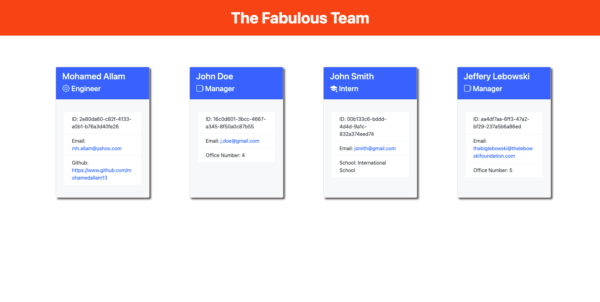
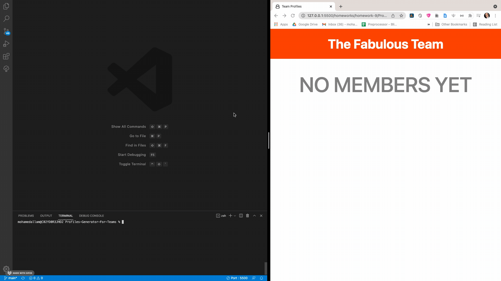
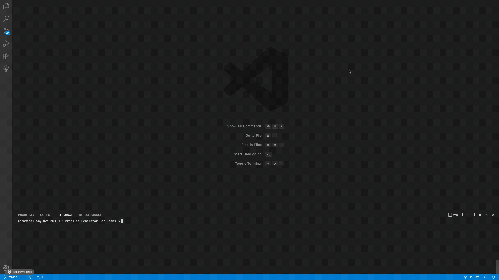
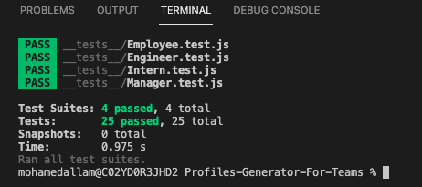

# Profiles-Generator-For-Teams

## Description 
A tool that generates an HTML File including info cards of employees, created from CL input inquiring on Employee info.



## Table of Contents

* [Technologies](#technologies)
* [Installation](#installation)
* [Feature](#feature)
* [Usage](#usage)
* [Testing](#testing)
* [License](#license)
* [Questions](#questions)
* [Screens](#screens)


## Technologies 

* JavaScript ES6
* HTML5
* CSS3
* Node.js
* npm
* Inquirer
* jest

## Installation 

Following are the steps of installation

```
npm i
```

## Features

* Easy to use, step by step inquirer to get all necessary information from the user
* Offers a main menu, to add new employees, clear current or quit
* The use of general classes that extends to specific classes and the reliance on OOP
* Sleek and ploished front end that is responsive and user friendly

## Usage 

Unrestricted usage.

## Testing

```
npm run test
```

## License 

None.

## Screens

This following gif shows the whole journey of the application.



This following gif shows the testing.



Testing screenshot.



This is what the user sees when no cards are there yet.


## Questions 

If you have any more questions, please contact me here:

Github Username: [mohamedallam13](https://github.com/mohamedallam13)

Email: [mohamedallam.tu@gmail.com](mailto:mohamedallam.tu@gmail.com)


